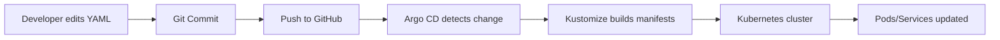

# GitOps-ArgoCD
# 🚀 GitOps with Argo CD – Local Kubernetes Project

This project demonstrates a **complete GitOps workflow** using **Argo CD** and **Kubernetes (Minikube)** on a local system. The goal is to show how **Git becomes the single source of truth** for application deployments, with **automatic synchronization** to the cluster.

---

## 🧠 What We Built

* A local Kubernetes cluster using **Minikube**
* **Argo CD** installed inside the cluster
* A GitHub repository that stores Kubernetes manifests
* An **Nginx application** deployed via **GitOps (Kustomize)**
* Automatic sync from Git → Kubernetes

---

## 🔁 GitOps Flow (How Everything Works)



### In simple words:

1. You change something in YAML (e.g., replicas)
2. You commit & push to GitHub
3. Argo CD watches the repo
4. Argo CD syncs the change automatically
5. Kubernetes updates the running application

---

## 🛠 Tools Used

| Tool      | Purpose                  |
| --------- | ------------------------ |
| Git       | Version control          |
| GitHub    | GitOps source of truth   |
| Minikube  | Local Kubernetes cluster |
| kubectl   | Kubernetes CLI           |
| Argo CD   | GitOps controller        |
| Kustomize | Manifest customization   |
| Docker    | Container runtime        |

---

## 📂 Repository Structure

```text
GitOps-ArgoCD
└── apps
    └── nginx
        └── dev
            ├── deployment.yaml
            ├── service.yaml
            └── kustomization.yaml
```

### Why this structure?

* `apps/` → All applications
* `nginx/` → One application
* `dev/` → One environment

This structure easily scales to:

```
nginx/dev
nginx/prod
```

---

## 📄 Kubernetes Manifests Explained

### deployment.yaml

* Defines **how many pods** to run
* Uses official `nginx` image
* Controlled entirely via Git

Key field:

```yaml
replicas: 3
```

Changing this value in Git **scales the app automatically**.

---

### service.yaml

* Exposes the Nginx pods internally
* Uses `ClusterIP`
* Stable networking inside cluster

---

### kustomization.yaml

```yaml
resources:
  - deployment.yaml
  - service.yaml
```

This file tells **Kustomize** what to deploy.
Argo CD runs:

```
kustomize build apps/nginx/dev
```

---

## 🔐 Argo CD Application Configuration

* **Application Name:** nginx-dev
* **Sync Policy:** Automatic
* **Namespace:** nginx-dev
* **Source:** GitHub repository
* **Path:** apps/nginx/dev

Once created, Argo CD continuously ensures:

> Kubernetes state == Git state

---

## 🔄 GitOps in Action (Scaling Example)

### Step 1: Change code

```yaml
replicas: 2  →  replicas: 3
```

### Step 2: Commit

```bash
git commit -am "Scale nginx to 3 replicas"
```

### Step 3: Push

```bash
git push
```

### Result

* Argo CD detects new commit
* Sync starts automatically
* Kubernetes scales pods

No manual deployment commands needed.

---

## 🧪 Verification Commands

```bash
kubectl get pods -n nginx-dev
kubectl get svc -n nginx-dev
```

---

## 🧠 Key Learnings

* Git is the **single source of truth**
* No manual `kubectl apply`
* Rollbacks are done via **Git revert**
* Argo CD handles drift & self-healing
* Kustomize enables clean multi-env setup

---

## ✅ Project Status

✔ GitOps implemented
✔ Auto-sync working
✔ Scalable structure
✔ Interview-ready

---

Happy GitOps 🚀
